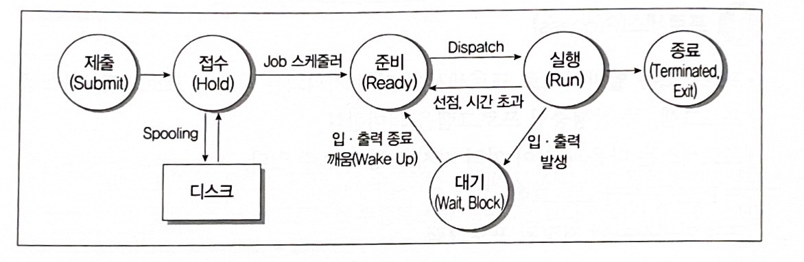
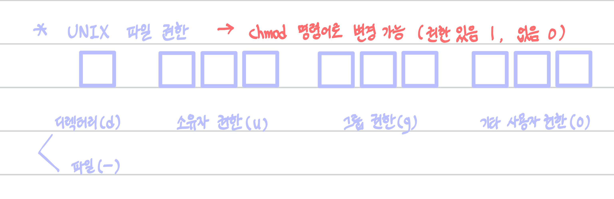

<link rel="stylesheet" href="../style.css">

# OS

1. 운영체제의 종류

 

### 1) Windows

> **개념** : 1990년대 Microsoft 사가 개발한 운영체제
>
> **특징**
>
> - **그래픽 사용자 인터페이스 (GUI, Graphic User Interface)**
>    - 키보드로 명령어 직접 입력 X
>    - 마우스로 아이콘이나 메뉴 선택해 작업 수행
>
> - **선점형 멀티태스킹 (Preemptive Multi-Tasking)**
>    - 동시에 여러 개 프로그램 실행, 운영체제가 각 작업의 CPU 이용 시간 제어
>    - 응용 프로그램 실행 중 문제 발생 시, 해당 프로그램 강제 종료 & 시스템 자원 반환
>
> - **PnP (Plug and Play, 자동 감지 기능)**
>    - 시스템에 프린터/사운드 카드 등 하드웨어 설치 시, 필요한 시스템 환경을 운영체제가 자동 구성
>
> - **OLE (Object Linking and Embedding)**
>    - 여러 응용 프로그램에서 작성된 문자/그림 등 개체(Object)를 현재 문서에 자유롭게 연결(Linking), 삽입(Embedding)해 편집 가능
>
> - **255자의 긴 파일명**
>    - \ / * ? " < > | 제외한 모든 문자 및 공백 사용하여 최대 255자까지 파일명 지정 가능
>
> - **Single-User 시스템**
>    - 컴퓨터 한 대를 한 사람만 독점

 

### 2) UNIX

> **개념** : 1960년 AT&T 벨(Bell) 연구소, MIT, General Electric 공동 개발
>
> **특징**
> - 시분할 시스템(Time Sharing System)을 위해 설계된 대화식 운영체제
> - 소스 공개된 개방형 시스템(Open System)
> - 대부분 C 언어 => 이식성 높음, 장치/프로세스 간 호환성 높음
> - 다중 사용자(Multi-User), 다중 작업(Multi-Tasking) 지원
> - 트리 구조의 파일 시스템

 

> 💡 **UNIX 시스템 - 구성 요소**
>
> - **커널(Kernel)**
>    - 하드웨어 보호, 프로그램-하드웨어 간 인터페이스 역할
>    - UNIX 핵심 파트
>    - 프로세스(CPU 스케쥴링) 관리, 기억장치 관리, 파일 관리, 입/출력 관리, 프로세스 간 통신, 데이터 전송 및 변환 등 수행
>
> - **쉘(Shell)**
>    - [명령어 해석기] 사용자 명령어 인식 => 프로그램 호출 및 명령 수행
>    - 시스템-사용자 간 인터페이스 담당
>    - 종류 : Bourne Shell, C Shell, Korn Shell
>
> - **유틸리티 프로그램(Utility Program)**
>    - 일반 사용자가 작성한 응용 프로그램 처리에 사용
>    - DOS에서의 외부 명령어에 해당
>    - 종류 : 에디터, 컴파일러, 인터프리터, 디버거 등

 

### 3) LINUX

> **개념** : 1991년 리누스 토발즈(Linus Torvalds)가 UNIX 기반으로 개발
>
> **특징**
> - 소스 코드 무료 공개 => 프로그래머가 원하는 기능 추가 가능
> - 다양한 플랫폼에 설치해 사용 가능, 재배포 가능
> - UNIX와 완벽 호환, 대부분의 특징 동일

 

### 4) MacOS

> **개념** : 1980년대 애플(Apple) 사가 UNIX 기반으로 개발
>
> **특징**
> - 아이맥(iMac)과 맥북(MacBook) 등 애플 사에서 생산하는 제품에서만 사용 가능
> - 드라이버 설치, install / uninstall 과정 단순

 

### 5) Android

> **개념** : 구글 사에서 개발 / LINUX 커널 기반의 개방형 모바일 운영체제
>
> **특징**
> - 모든 코드 공개된 개방형 소프트웨어
> - 자바, 코틀린으로 작성
> - 스마트폰 등 휴대용 장치에서 주로 사용

 

### 6) iOS

> **개념** : 애플 사에서 개발 / UNIX 기반의 모바일 운영체제
>
> **특징**
> - 아이폰, 아이팟 터치, 아이패드 등에 내장
> - 애플 사 고유 모바일 운영체제 / 타사 제품은 iOS 탑재 불가

 

2. 페이지 교체 알고리즘

 

> **개념** : 페이지 부재(Page Fault) 발생 시, 가상기억장치에서 필요한 페이지를 찾아 주기억장치에 적재해야 하는데, 주기억장치의 어떤 페이지 프레임을 선택하여 교체할 지 결정하는 기법
>
> **종류**
> - OPT
> - FIFO
> - LRU
> - LFU
> - NUR
> - SCR

 

### 1) OPT (OPTimal replacement, 최적 교체)

> **개념** : 앞으로 가장 오래 사용하지 않을 페이지 교체
>
> - 벨레이디(Belady)가 제안
> - 페이지 부재 횟수가 가장 적게 발생 / 가장 효율적 알고리즘

 

### 2) FIFO (First In First Out)

> **개념** : 가장 먼저 들어와서 가장 오래 있었던 페이지 교체

 

### 3) LRU (Least Recently Used)

> **개념** : 최근 가장 오랫동안 사용하지 않은 페이지 교체
>
> - 각 페이지마다 계수기(Counter)나 스택(Stack)을 두고, 현 시점에서 가장 오래 사용하지 않은 페이지 교체

 

### 4) LFU (Least Frequently Used)

> **개념** : 사용 빈도가 가장 적은 페이지를 교체

 

### 5) NUR (Not Used Recently)

> **개념** : LRU와 비슷 / 최근에 사용하지 않은 페이지를 교체
>
> - LRU에서 나타나는 시간적 오버헤드 줄일 수 O
> - 최근 사용 여부 확인을 위해, 각 페이지 마다 두 개의 비트(참조 비트, 변형 비트) 사용

 

### 6) SCR (Second Chance Replacement, 2차 기회 교체)

> **개념** : 가장 오래 주기억장치에 있던 페이지 중 자주 사용되는 페이지의 교체 방지를 위한 기법
>
> - FIFO 단점 보완

 

3. 가상기억장치 기타 관리 사항

 

### 1) 페이지 크기

> 💡 (페이징 기법 사용 시) 페이지 크기에 따라 시스템에 미치는 영향이 다르다.
>
> - **페이지 크기 작을 경우**
>    - 장점 
>        - 페이지 단편화 감소
>        - 1개 페이지를 주기억장치로 이동시키는 시간 감소
>        - 불필요한 내용이 적재될 확률 적음 => 효율적 워킹 셋
>    - 단점
>        - 페이지 맵 테이블 크기 커짐 & 매핑 속도 늦어짐
>        - 디스크 접근 횟수 많아짐 => 전체 입/출력 시간 증가
>
> - **페이지 크기 클 경우**
>    - 장점 
>        - 페이지 맵 테이블 크기 작아짐 & 매핑 속도 빨라짐
>        - 디스크 접근 횟수 줄어듬 => 전체 입/출력 효울성 증가
>    - 단점
>        - 페이지 단편화 증가
>        - 1개 페이지를 주기억장치로 이동시키는 시간 증가

 

### 2) Locality (국부성, 지역성, 구역성, 국소성)

> **개념** : 주기억장치 참조 시, 일부 페이지만 집중 참조하는 성질
>
> - (스래싱 방지하기 위한) '워킹 셋' 이론의 기반
> - '가상기억장치 관리', '캐시 메모리 시스템'의 이론적 근거
> - 데닝(Denning) 교수에 의해 증명

 

> **Locality 종류**
>
> - **시간 구역성(Temporal Locality)**
>    - 하나의 페이지를 일정 시간 동안 집중 액세스
> - **공간 구역성(Spatial Locality)**
>    - 일정 위치의 페이지를 집중적으로 액세스

 

### 3) 워킹 셋(Working Set)

> **개념** : 프로세스가 일정 시간 동안 **자주 참조하는 페이지 집합**
>
> - 프로그램의 움직임에 대한 모델 / Locality 특징 이용
> - 자주 참조되는 워킹 셋을 주기억장치에 상주 => 페이지 부재, 페이지 교체 현상 줄어 => 기억장치 사용 안정

 

### 4) 스래싱(Thrashing)

> **개념** : 프로세스 처리 시간보다 **페이지 교체에 소요되는 시간이 더 많아지는** 현상
>
> - 다중 프로그래밍 시스템, 가상기억장치 사용하는 시스템에서 '페이지 부재(Page Fault)' 자주 발생하면 발생
> - 전체 시스템 성능 저하
> - (다중 프로그래밍 정도 높아짐에 따라) CPU 이용률은 어느 시점까지 높아지다가, 스래싱 나타나고 급격히 감소

 

4. 프로세스의 개요

 

### 1) 프로세스(Process)

> **개념** : 실행 중인 프로그램
>
> **다양한 정의**
>
> - PCB를 가진 프로그램
> - 실기억장치에 저장된 프로그램
> - 프로세서가 할당되는 실체 / 디스패치 가능한 단위
> - 프로시저(분할된 작은 프로그램)가 활동중인 것
> - 비동기적 행위를 일으키는 주체
> - 지정된 결과를 얻기 위한 일련의 계통적 동작
> - 목적/결과에 따라 발생되는 사건들의 과정
> - 운영체제가 관리하는 실행 단위

 

### 2) PCB (Process Control Block, 프로세스 제어 블록)

> **개념** : 운영체제가 프로세스에 대한 중요 정보를 저장해 놓는 곳
>
> => 프로세스 생성될 떄마다 고유 PCB 생성, 완료되면 제거됨
>
> **PCB에 저장되어 있는 정보**
> - 프로세스 현재 상태
> - 포인터
> - 프로세스 고유 식별자
> - 스케줄링 및 프로세스 우선순위
> - CPU 레지스터 정보
> - 주기억장치 관리 정보
> - 입/출력 상태 정보
> - 계정 정보

 

### 3) 프로세스 상태 전이

> **개념** : 프로세스 상태가 변하는 것

> **프로세스 상태** (상태 전이도로 표시)
>
> - 제출(Submit) : 사용자가 작업을 시스템에 제출한 상태
> - 접수(Hold) : 제출된 작업이 디스크 할당 위치에 저장된 상태
> - 준비(Ready) : 프로세스가 프로세서를 할당받기 위해 기다리는 상태
> - 실행(Run) : 큐에 있는 프로세스가 프로세서 할당받아 실행되는 상태
> - 대기(Wait), 블록(Block) : 실행 중인 프로세스가 중단되고, 입/출력 처리 완료 시까지 대기하는 상태
> - 종료(Terminated, Exit) : 프로세스 실행 끝, 프로세스 할당 해제된 상태

 

> **관련 용어**
>
> - **Dispatch** : 준비(Ready) => 실행(Run)
>    - 대기하던 프로세스가 프로세서 할당받아 실행
>
> - **Wake Up** : 대기(Wait) => 준비(Ready)
>    - 입/출력 작업 완료 되어 이동
>
> - **Spooling** : 입/출력 데이터를 (입/출력장치에 직접 안 보내고) 나중에 한꺼번에 입/출력하려고 디스크에 저장
>    - 목적
>        - 입/출력장치 공유
>        - 입/출력장치의 느린 처리 속도 보완
>        - 다중 프로그래밍 시스템 성능 향상
>
> **교통량 제어기(Traffic Controller)** : 프로세스 상태에 대한 조사/통보

 

### 4) 스레드(Thread)

> **개념** : 여러 시스템 자원을 할당받아 실행하는 프로그램 단위 (프로세스 내 작업 단위)
>
> - 단일 스레드, 다중 스레드
> - '경량 프로세스'라고도 함
> - (스레드 기반 시스템) 독립적인 스케줄링의 최소 단위 / 프로세스 역할을 담당

 

5. 주요 스케줄링 알고리즘

 

### 1) FCFS (First Come, First Service, 선입선출) = FIFO

> **개념** : 큐에 도착한 순서에 따라 차례로 CPU 할당
>
> - 비선점 기법 (가장 간단)

 

### 2) SJF (Shortest Job First, 단기 작업 우선)

> **개념** : 실행 시간이 가장 짧은 프로세스에게 먼저 CPU 할당
>
> - 가장 적은 평균 대기 시간 (최적 알고리즘)

 

### 3) HRN (Highest Response-ratio Next)

> **개념** : 대기 시간 & 서비스(실행) 시간 이용
>
> - 비선점형 스케줄링
> - (실행 시간 긴 프로세스에 불리한) SJF 기법 보완
> - 우선순위 계산 => 높은 것부터 우선순위 부여
>    - 우선순위 = (대기시간 + 서비스시간) / 서비스시간

 

### 4) RR (Round Robin)

> **개념** : 각 프로세스를 시간 할당량(Time Slice, Quantum) 동안만 실행 후 => 다음 프로세스에게 CPU 넘김
>
> - 시분할 시스템(Time Sharing System) 위해 고안한 방식
> - 할당되는 시간 크기
>    - 작으면 => 작은 프로세스 유리 / 문맥 교환 및 오버헤드 자주 발생해 신속한 처리 X
>    - 크면 => FCFS 기법과 같아짐

 

> **대기 시간** : 가장 마지막 실행 시작 시각 - 앞선 실행 시간
>
> **반환 시간** : 각 프로세스 완료 시각

 

### 5) SRT (Shortest Remaining Time)

> **개념** : 현재 실행 중인 프로세스의 남은 시간 - 큐에 도착한 프로세스 실행 시간 비교 => 가장 짧은 실행 시간 요구하는 프로세스에 CPU 할당
>
> - 시분할 시스템에 유용
> - 큐에 있는 각 프로세스 실행 시간 추적해야 하므로 => 오버헤드 증가

 

6. 운영체제 기본 명령어

 

### 1) Windows 기본 명령어

> - **DIR** : 현재 디렉터리의 파일 목록 표시 (= ls)
>    - /P : 한 화면 단위로 표시
>    - /W : 가로로 나열
>    - /O : 지정한 정렬 방식 (D : 날짜/시간, E : 확장자, N : 파일 이름, S : 파일 크기)
>    - /S : 하위 디렉터리 정보까지
>    - /A : 지정 속성이 설정된 파일 목록 표시
>
> - **COPY** : 파일 복사 (= cp)
>    - copy abc.txt gilbut : abc.txt 파일을 gilbut 디렉터리로 복사
>
> - **DEL** : 파일 삭제 (= rm)
>    - del abc.txt
>
> - **TYPE** : 파일 내용 표시 (= cat)
>    - type abc.txt
>
> - **REN** : 파일 이름 변경
>    - ren abc.txt 123.txt
>
> - **MD** : 디렉터리 생성 (= mkdir)
>    - md gilbut
>
> - **CD** : 디렉터리 위치 변경 (= cd)
>    - cd gilbut
>
> - **CLS** : 화면에 표시된 모든 내용 지움
>
> - **ATTRIB** : 파일 속성 변경
>    - attrib +r abc.txt : abc.txt 파일 속성을 '읽기 전용'으로 변경
>
>    - ✅ **속성 종류 (지정 + / 해제 -)**
>        - R : 읽기 전용
>        - A : 저장/백업
>        - S : 시스템 파일
>        - H : 숨김 파일
>
> - **FIND** : 파일에서 문자열 찾음
>    - find "123" abc.txt
>
> - **CHKDSK** : 디스크 상태 점검 (현재 드라이브 상태 점검)
>
> - **FORMAT** : 디스크 표면을 트랙/섹터로 나누어 초기화
>    - format c: : c드라이브 초기화
>
> - **MOVE** : 파일 이동 (= mv)
>    - move abc.txt gilbut

 

### 2) UNIX/LINUX 기본 명령어

> - **cat** : 파일 내용 화면에 표시 (= TYPE)
>    - cat abc.txt
>
> - **cd** : 디렉터리 위치 변경 (= CD)
>    - cd gilbut
>
> - **chmod** : 파일 보호 모드 설정해, 파일 사용 허가 지정
>    - chmod u=rwx abc.txt : user(u)에게 abc.txt 파일의 읽기(r), 쓰기(w), 실행(x) 권한 부여(=)
>
>        
>        - 예를 들어, rwx rwx r-x 권한 변경 하는 경우 : 111 111 101 => 775 => chmod 775 batch.sh
>
>    - ✅ **chmod 문자열 모드 - 사용자**
>        - u : user (소유자)
>        - g : group
>        - o : other (다른 사용자)
>        - a : all (모두)
>
> - **chown** : 파일 소유자와 그룹 변경
>    - chown member1 abc.txt : abc.txt 파일의 소유자를 member1로 변경
>
> - **cp** : 파일 복사 (= COPY)
>    - cp abc.txt gilbut/abc2.txt : abc.txt 파일을 gilbut 디렉터리에 abc2.txt로 이름 변경해 복사
>
> - **rm** : 파일 삭제 (= DEL)
>    - rm abc.txt
>
> - **find** : 파일 찾기
>    - find abc.txt
>
> - **fsck** : 파일 시스템 검사/보수
>    - fsck /dev/sda1 : /dev/sda1에 기록된 모든 파일 시스템 검사/보수
>
> - **kill** : PID(프로세스 고유 번호) 이용해 프로세스 종료
>    - kill 1234
>
> - **killall** : 프로세스 이름 이용해 프로세스 종료
>    - killall gilbut
>
> - **fork** : 새로운 프로세스 생성
>    - fork()
>
> - **ls** : 현재 디렉터리 파일 목록 표시 (= DIR)
>    - 파란색 : 실행 파일 / 흰색 : 비실행 파일
>
> - **mkdir** : 디렉터리 생성 (= MD)
>    - mkdir gilbut
>
> - **rmdir** : 디렉터리 삭제
>    - rmdir gilbut
>
> - **mv** : 파일 이동 (= MOVE)
>    - mv abc.txt gilbut/abc2.txt : abc.txt 파일을 gilbut 디렉터리에 abc2.txt로 이름 변경해 이동
>
> - **ps** : 현재 실행 중인 프로세스 표시
>
> - **pwd** : 현재 작업 중인 디렉터리 경로를 화면에 표시
>
> - **top** : 시스템 프로세스와 메모리 사용 현황 표시
>
> - **who** : 현재 시스템에 접속해 있는 사용자 표시

 

7. 회복 / 병행제어

 

### 1) 회복(Recovery)

> **개념** : 트랜잭션 수행 중 장애 발생으로 DB 손상 시, 이전 정상 상태로 복구하는 작업
>
> **회복 기법의 종류**
>
> - **연기 갱신 기법(Deferred Update)**
>    - 트랜잭션이 성공적으로 완료될 때까지 DB 실질 갱신을 연기
>    - 갱신된 내용은 일단 Log에 보관
>    - 트랜잭션 부분 완료 시점에 Log 보관 내용을 실제 DB에 기록
>    - Redo 작업만 가능
> 
> - **즉각 갱신 기법(Immediate Update)**
>    - 트랜잭션이 데이터 갱신하면, 부분 완료 전이라도 즉시 실제 DB에 반영
>    - 장애 발생 대비해 갱신 내용은 Log에 보관
>    - Redo, Undo 모두 가능
>
> - **그림자 페이지 대체 기법(Shadow Paging)**
>    - 갱신 이전 DB를 일정 크기의 페이지 단위로 구성, 페이지마다 복사본 별도 보관
>    - 실제 페이지 대상으로 갱신하다가
>    - 장애 발생해 Rollback 시, 갱신 이후의 실제 페이지 부분을 그림자 페이지로 대체하여 회복
>
> - **검사점 기법(Check Point)**
>    - 트랜잭션 실행 중 특정 단계에서 재실행할 수 있도록, 갱신 내용/시스템 상황 등과 함께 검사점을 Log에 보관
>    - 장애 발생 시, 트랜잭션 전체 철회 X / 검사점부터 회복 작업 수행 (회복 시간 절약)

 

### 2) 병행 제어 (Concurrency Control)

> **개념** : 여러 트랜잭션을 병행 수행(다중 프로그래밍)할 때, 트랜잭션 간 상호작용 제어
>
> **목적** : 동시 실행되는 트랜잭션들이 DB 일관성 파괴하지 않도록

> ✅ **병행 제어 없이 트랜잭션들이 DB에 동시 접근하게 되면?**
>
> - 갱신 분실 : 같은 자료를 갱신하면서, 갱신 결과의 일부가 없어짐
> - 비완료 의존성 : 트랜잭션 A가 실패 후 회복 전에, 트랜잭션 B가 실패한 갱신 결과를 참조하는 현상
> - 모순성
> - 연쇄 복귀 : 트랜잭션 A에 문제가 생겨 Rollback하는 경우, 트랜잭션 B도 함께 Rollback 되는 현상

 

> 💡 **병행제어 기법의 종류**
>
> - **로킹(Locking)**
>    - 트랜잭션이 어떤 로킹 단위 액세스하기 전, Lock(잠금) 요청해서 허락되어야만 액세스 가능
>    - 주요 데이터의 액세스를 상호 배타적으로 함
>
> - **타임 스탬프 순서(Time Stamp Ordering)**
>    - (트랜잭션 실행 시작 전) 시간표(Time Stamp) 부여하고, 부여된 시간에 따라 작업 수행
>    - 트랜잭션 및 데이터들이 <u>이용될 때</u>의 시간을 시간표로 관리
>    - (직렬성 순서 결정을 위해) 트랜잭션 간 처리 순서 미리 선택하는 기법 중 가장 보편적
>
> - **최적 병행수행(검증 기법, 확인 기법, 낙관적 기법)**
>    - 상황 : 병행수행하려는 대부분의 트랜잭션이 판독 전용(Read Only)일 경우
>    - 병행제어 기법 사용 안해도, 트랜잭션 간 충동률이 매우 낮아서 대부분 시스템 상태를 일관성 있게 유지
>
> - **다중 버전 기법**
>    - 타임 스탬프 개념 이용 (= 다중 버전 타임 스탬프 기법)
>    - 트랜잭션 및 데이터들이 <u>갱신될 때</u> 마다의 버전을 부여해 관리

 

### 3) 로킹 단위(Locking Granularity)

> **개념** : (병행 제어에서) 한꺼번에 로킹할 수 있는 객체 크기
>
> - 로킹 단위 = DB, 파일, 레코드, 필드 등
>
> - 로킹 단위의 크기
>    - 크면 => 로크 수 적어서 관리하기 쉬움 / 병행성 수준 낮아짐(DB 공유도 감소)
>    - 작으면 => 로크 수 많아서 관리 복잡, 오버헤드 증가 / 병행성 수준 올라감(DB 공유도 증가)

 

8. 교착 상태 (Dead Lock)

 

> **개념** : (둘 이상의 프로세스가 자원 점유한 상태에서) 서로 다른 프로세스가 점유하고 있는 자원을 요구하며 무한정 기다리는 현상

### 1) 교착상태 발생의 필요 충분 조건

> - **상호 배제(Mutual Exclusion)** : 한 번에 한 개의 프로세스만 공유 자원 사용 가능
>
> - **점유와 대기(Hold and Wait)** : 최소 한 개의 자원을 점유하면서 & (다른 프로세스에 할당되어 사용되고 있는) 자원을 추가 점유하기 위해 대기하는 프로세스 존재
>
> - **비선점(Non-preemption)** : 다른 프로세스에 할당된 자원은 (사용 끝날 때까지) 강제로 못 빼앗음
>
> - **환형 대기(Circular Wait)** : 공유 자원 & 공유 자원 사용 위해 대기하는 프로세스들이 원형으로 구성 => 자신에게 할당된 자원을 점유하면서 앞/뒤 프로세스의 자원을 요구

 

### 2) 교착상태 해결 방법

> **예방 기법(Prevention)**
> - 사전 시스템 제어
> - 교착상태 발생 조건 4가지 중 어느 하나 제거
> - 자원 낭비가 가장 심한 기법
>
> **회피 기법(Avoidance)**
> - (교착상태 발생 가능성을 배제하지 않고) 교착상태 발생 시 적절히 피하는 방법
> - 주로, 은행원 알고리즘(Banker's Algorithm) 사용
>    - E.J.Dijkstra가 제안
>    - 은행에서 모든 고객의 요구 충족되도록 현금을 할당하는 데에서 유래
>
> **발견 기법(Detection)**
> - 시스템 교착상태 점검 => (교착상태에 있는) 프로세스/자원 발견
> - 교착상태 발견 알고리즘, 자원 할당 그래프 등 사용
>
> **회복 기법(Recovery)**
> - 교착상태 일으킨 프로세스 종료 or 교착상태 프로세스에 할당된 자원을 선점 => 프로세스/자원 회복

 

