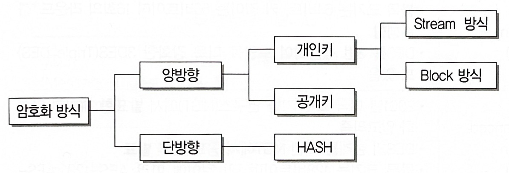

<link rel="stylesheet" href="../style.css">

# Secure

1. Secure SDLC

 

### 1) Secure SDLC

> **개념** : SDLC(Software Development Life Cycle, 소프트웨어 개발 생명주기)에 보안 강화를 위한 프로세스 포함한 것
>
> **대표적인 방법론**
>
> - **CLASP** : SDLC 초기에 보안 강화를 위해 개발
> - **SDL** : Microsoft 사에서 안전한 소프트웨어 개발 위해 기존 SDLC 개선
> - **Seven Touchpoints** : 소프트웨어 보안의 모범사례를 SDLC에 통합

 

### 2) SDLC 단계별 보안 활동

> **1. 요구사항 분석** : 보안 항목에 해당하는 요구사항 식별
>
> **2. 설계** : 식별된 보안 요구사항 => 소프트웨어 설계서에 반영, 보안 설계서 작성
>
> **3. 구현** : (표준 코딩 정의서/소프트웨어 개발 보안 가이드 준수하며) 설계서 따라, 보안 요구사항 구현
>
> **4. 테스트** : (보안 설계서 바탕으로) 보안 사항이 정확히 반영/동작하는지 점검
>
> **5. 유지보수** : 발생할 수 있는 보안사고 식별 / 사고 발생 시 해결 및 보안 패치

 

### 3) 소프트웨어 개발 보안 요소

> **기밀성(Confidentiality)**
>    - 시스템 내 정보/자원 => 인가된 사용자에게만 접근 허용
>    - 전송 중 정보 노출되더라도 데이터 읽을 수 X
>
> **무결성(Integrity)**
>    - (시스템 내 정보는) 인가된 사용자만 수정 가능
>
> **가용성(Availability)**
>    - 인가받은 사용자는 시스템 정보/자원 언제라도 사용 가능
>
> **인증(Authentication)**
>    - 합법적 사용자인지 확인하는 모든 행위
>    - 대표 방법 : 패스워드, 인증용 카드, 지문 검사 등
>
> **부인 방지(NonRepudiation)**
>    - 송/수신 증거 제공
>    - 목적 : 데이터 송/수신자가 해당 사실 부인할 수 없도록

 

### 4) 시큐어 코딩(Secure Coding)

> **개념** : 보안 요소들을 고려하면서 코딩하는 것 (보안 취약점 최소화를 위해)
>
> - 보안 취약점 사전 대응 => 안정성/신뢰성 확보
> - (보안 정책 바탕으로) 시큐어 코딩 가이드 작성 / 시큐어 코딩 교육 실시

 

2. 입력 데이터 검증 및 표현

 

> **개념** : 구현 단계에서 검증해야 할 보안 점검 항목들
>
> **목적** : 입력 데이터로 인한 문제 예방

 

> 💡 **구현 단계에서 검증해야 할 보안 점검 내용 (7가지)**
>
> - <u>입력 데이터 검증 및 표현</u>
> - 보안 기능
> - 시간 및 상태
> - 에러 처리
> - 코드 오류
> - 캡슐화
> - API 오용

 

> ✅ **입력 데이터 검증 및 표현 - 보안 약점**
>
> **SQL 삽입(Injection)**
> - 응용 프로그램에 SQL 삽입 => (내부 DB 서버의) 데이터 유출 및 변조, 관리자 인증 우회
> - => <u>동적 쿼리</u>에 사용되는 <u>입력 데이터에 예약어/특수문자 입력되지 않도록</u> 필터링 설정
>
> **경로 조작 및 자원 삽입**
> - 데이터 입출력 경로 조작 => 서버 자원을 수정/삭제
> - => (사용자 입력값을 식별자로 사용하는 경우) <u>경로 순회 공격을 막는 필터</u> 사용
>
> **크로스사이트 스크립팅(XSS)**
> - 웹페이지에 악의적 스크립트 삽입 => 방문자 정보 탈취, 비정상 기능 수행 유발
> - => <u>HTML 태그 사용 제한</u> / 스크립트에 삽입되지 않도록 <u>'<, >, &' 등의 문자를 다른 문자로 치환</u>
>
> **운영체제 명령어 삽입**
> - 외부 입력 값을 통해 시스템 명령어 실행 유도 => 권한 탈취, 시스템 장애 유발
> - => 웹 <u>인터페이스 통해 시스템 명령어 전달 X</u> / 외부 <u>입력 값을 검증 없이 내부 명령어로 사용 X</u>
>
> **위험한 형식 파일 업로드**
> - 악의적 명령어가 포함된 스크립트 파일 업로드 => 시스템 손상/제어
> - => 업로드 되는 <u>파일 확장자 제한, 파일명 암호화, 웹사이트/파일 서버 경로 분리</u>, 실행 속성 제거 등
>
> **신뢰되지 않는 URL 주소로 자동접속 연결**
> - 입력 값으로 사이트 주소 받는 경우, 이를 조작 => 피싱 사이트로 유도
> - => 연결되는 <u>외부 사이트 주소를 화이트 리스트로 관리</u>
>
> **메모리 버퍼 오버플로**
> - 할당된 메모리 범위를 넘어선 위치에서 자료 읽기/쓰기 시 발생
> - => (메모리 버퍼 사용할 경우) <u>적절한 버퍼 크기 설정, 범위 내에서 올바르게 읽기/쓰기</u>

> ✅ **입력 데이터 검증 및 표현 - 추가 보안 약점**
>
> - XQuery / XPath / LDAP / 포맷 스트링 삽입
> - 크로스사이트 요청 위조
> - HTTP 응답 분할
> - 보안기능 결정에 사용되는 부적절한 입력값

 

3. 암호 알고리즘

 

> **개념** : 중요 정보 보호 위해 '평문 => 암호화된 문장'으로 만드는 절차/방법
>
> 

 

### 1) 개인키 암호화(Private Key Encryption) 기법

> **개념** : 동일한 키로 데이터 암호화 & 복호화 (= 대칭 암호 기법, 단일키 암호화 기법)
>
> **장/단점** : 속도 빠름 <-> 관리할 키의 수가 많음
>
> **종류**
> - **스트림 암호화 방식**
>    - 평문과 동일한 길이의 스트림 생성 / 비트 단위로 암호화
>    - 종류 : TKIP, LFSR, RC4
>
> - **블록 암호화 방식**
>    - 한 번에 하나의 데이터 블록 암호화
>    - 종류 : DES, AES, IDEA, Skipjack / SEED, ARIA

 

> ✅ **스트림 암호화 방식**
>
> - **TKIP(Temporal Key Integrity Protocol, 임시키 무결성 프로토콜)** 
>    - (무선랜 보안에 사용된) WEP 보완한 데이터 보안 프로토콜
>    - 키 길이 128비트
>    - 키 관리 방식 개선 (패킷당 키 할당, 키값 재설정 등)

> ✅ **블록 암호화 방식**
>
> - **DES(Data Encryption Standard)**
>    - 1975년, 미국 NBS(National Bureau of Standards / NIST 과거 이름)에서 발표
>    - 블록 크기 64비트 / 키 길이 56비트 / 16회 라운드 수행
>    - 3DES : DES 3번 적용해 보안 강화
>
> - **AES(Advanced Encryption Standard)**
>    - 2001년, 미국 표준 기술 연구소(NIST)에서 발표
>    - DES 한계를 느낀 NIST에서 공모 후 발표
>    - 블록 크기 128비트 / 키 길이에 따라 AES-128, AES-192, AES-256으로 분류
>
> - **IDEA(International Data Encryption Algorithm)**
>    - 1990년, 스위스 라이(Lai), 메시(Messey)가 개발
>    - PES 개선한 알고리즘
>    - 블록 크기 64비트 / 키 길이 128비트
>
> - **Skipjack**
>    - 국가 안전 보장국(NSA)에서 개발
>    - 클리퍼 칩(Clipper Chip)이라는 IC칩에 내장
>    - 블록 크기 64비트 / 키 길이 80비트
>    - 음성 통신 장비에 삽입 => 음성 데이터 암호화
>
> - **SEED**
>    - 1999년, 한국인터넷진흥원(KISA)에서 개발
>    - 블록 크기 128비트 / 키 길이에 따라 128, 256으로 분류
>
> - **ARIA(Academy, Research Institute, Agency)**
>    - 2004년, 국가정보원 & 산학연협회가 개발

 

### 2) 공개키 암호화(Public Key Encryption) 기법

> **개념** : 암호화하는 공개키(Public Key)는 사용자에게 공개 / 복호화할 때 비밀키(Secret Key)는 관리자가 관리 (= 비대칭 암호 기법)
>
> **장/단점** : 관리해야 할 키 수 적음 <-> 속도 느림
>
> **종류** : RSA, ECC

 

> ✅ **공개키 암호화 알고리즘**
>
> - **RSA(Rivest Shamir Adleman)**
>    - 1978년, MIT의 라이베스트(Rivest), 샤미르(Shamir), 애들먼(Adleman)에 의해 제안
>    - 큰 숫자를 소인수분해 하기 어렵다는 것에 기반
>
> - **ECC(Elliptic Curve Cryptography)**
>    - 1985년, RSA 대안으로 제시
>    - 이산대수 문제 => 타원곡선으로 옮겨, 기밀성/효율성 높임

 

### 3) 해시(Hash) - 단방향 암호화 방식

> **개념** : 임의 길이의 입력 데이터/메시지 => 고정 길이의 값/키로 변환
>
> - 해시 함수 : 해시 알고리즘
> - 해시값(해시키) : 해시 함수로 변환된 값/키
>
> **활용** : 정보보호 분야 (데이터 암호화 / 무결성 검증 등)

 

> ✅ **해시 함수 종류**
>
> - **SHA 시리즈**
>    - 1993년, 미국 국가안보국(NSA)이 설계, 미국 국립표준기술연구소(NIST)에서 발표
>    - SHA-0 => SHA-1 => SHA-2(SHA-224, SHA-256, SHA-384, SHA-512)
>
> - **MD5(Message Digest algorithm 5)**
>    - 1991년, R.Rivest가 MD4 대체하기 위해 고안한 암호화 해시 함수
>    - 블록 크기 512비트 / 키 길이 128비트
>
> - **N-NASH**
>    - 1989년, 일본 전신전화주식회사(NTT)에서 발표한 암호화 해시 함수
>    - 블록 크기 = 키 길이 128비트
>
> - **SNEFRU**
>    - 1990년, R.C.Merkle가 발표
>    - 32비트 프로세서에서 구현 용이하게 할 목적으로 개발

 

4. 서비스 공격 유형

 

### 1) 서비스 거부(DoS; Denial of Service) 공격

> **개념** : 대량의 데이터를 서버 한 곳에 집중 전송 => 표적이 되는 서버의 자원 고갈시키고, 정상 기능 방해

> 💡 **주요 유형**
>
> - **Ping of Death (죽음의 핑)** : (Ping 명령 전송 시) 패킷 크기를 인터넷 프로토콜 허용 범위 이상으로 전송 => 공격 대상의 네트워크를 마비시킴
>    - 공격에 사용되는 큰 패킷은 수백 개의 패킷으로 분할 전송됨 => 패킷 재조립 부담, 전송된 패킷들의 ICMP Ping 메시지에 응답하느라 시스템 다운
>
> - **SMURFING** : IP/ICMP 특성 악용해, 대량 데이터를 한 사이트에 집중 전송 => 네트워크 불능 상태로
>    - (송신 주소: 공격 대상지 IP 주소로 위장) => (수신지: 해당 네트워크 라우터의 브로드캐스트 주소)로 패킷 전송
>        - 수신된 패킷은 해당 네트워크 내 모든 컴퓨터로 전송됨
>        - (모든 컴퓨터는) 패킷에 대한 응답 메시지 => 송신 주소(공격 대상지)로 집중 전송
>        - 공격 대상지 네트워크 과부하
>    - <u>무력화 방법 : 각 네트워크 라우터에서 브로드캐스트 주소 사용 못하게 미리 설정</u>
>
> - **SYN Flooding** : 공격자가 가상 클라이언트로 위장 / (TCP의) 3-way-handshake 과정을 의도적으로 중단시킴 => (공격 대상지인) 서버가 대기 상태에 놓여, 정상 서비스 못하도록 함
>    - <u>대비 : 수신지의 SYN 수신 대기 시간 줄이기 / 침입 차단 시스템 활용</u>
>
> - **TearDrop** : (패킷 분할 순서 알 수 있는) Fragment Offset 값 변경 시켜, 패킷 재조립 시 오류 => 과부하 발생/시스템 다운
>    - <u>대비 : Fragment Offset 잘못된 경우, 해당 패킷 폐기 설정</u>
>
> - **LAND Attack(Local Area Network Denial Attack)** : 송신 IP, 수신 IP 주소를 모두 공격 대상의 IP 주소로 하여 패킷 전송 => 자신에 대해 무한 응답하게 하는 공격
>    - <u>대비 : 송/수신 IP 주소의 적절성 검사</u>
>
> - **DDoS(Distributed Denial of Service, 분산 서비스 거부) 공격** : 여러 곳에 분산된 공격 지점에서 한 곳 서버에 서비스 거부 공격
>    - 네트워크 취약점 있는 호스트 탐색 => 이들에 분산 서비스 공격용 툴 설치해 Agent로 만든 후 DDoS 공격에 이용

 

> ✅ **분산 서비스 공격용 툴(Daemon) - 종류**
>
> - Trin00 : 초기 형태 데몬 / 주로 UDP Flooding 공격
> - TFN(Tribe Flood Network) : UDP Flooding, TCP SYN Flood 공격, ICMP 응답 요청, 스머핑 공격 등
> - TFN2K : TFN 확장판
> - Stacheldraht : 공격자/마스터/에이전트가 노출되지 않도록 암호화된 통신 수행 / 툴 자동 업데이트

 

### 2) 네트워크 침해 공격 관련 용어

> - **세션 하이재킹(Session Hijacking)**
>    - 클라이언트 사이의 세션 정보 가로채는 공격
>    - 가로챈 세션 이용해 클라이언트로 위장 => (인증 정보 없이도) 서버 자원/데이터 무단 이용
>    - ex) TCP 세션 하이재킹 : TCP 3-Way-Handshake 과정에 끼어들어, 클라이언트-서버 간 동기화된 시퀀스 번호 가로채, 서버 무단 접근
>
> - **타이포스쿼팅(Typosquatting)** (= URL Hijacking)
>    - (사이트 주소 잘못 입력 / 철자 실수 이용) 유사한 유명 도메인을 미리 등록하는 일 
>
> - **ARP 스푸핑(ARP Spoofing)**
>    - ARP 취약점 이용한 공격
>    - 자신의 물리적 주소(MAC)를 공격대상 것으로 변조 => 공격 대상에게 도달해야 하는 데이터 패킷 가로채거나 방해
>
> - **스니핑(Sniffing)**
>    - 네트워크 중간에서 패킷 정보 도청 / 수동적 공격
>
> - **다크 데이터(Dark Data)**
>    - 특정 목적 가지고 데이터 수집했으나, 활용 없이 저장만 되어 있는 대량 데이터
>
> - **사회 공학(Social Engineering)**
>    - 인간 상호 작용의 신뢰 바탕으로 사람들 속여, 정상 보안 절차 깨뜨리기 위한 비기술적 시스템 침입 수단
>
> - **스피어 피싱(Spear Phishing)**
>    - 사회 공학의 한 기법
>    - 특정 대상에게 이메일 지속 발송 => 본문 링크나 첨부 파일 클릭 유도 => 개인 정보 탈취
>
> - **스미싱(Smishing)**
>    - 문자(SMS) 이용해 개인 신용 정보 빼내는 수법
>    - (초기) 개인 비밀정보, 소액 결제 유도
>    - (현재) 각종 행사 안내 등 문자에 링크 걸어, 안드로이드 앱 설치 파일(apk) 설치 유도
>
> - **APT(Advanced Persistent Threats, 지능형 지속 위협)**
>    - 조직적으로 특정 기업/조직 네트워크 침투 => 보안 무력화, 정보 수집 후 빼돌리는 공격
>    - 공격 방법
>        - 내부자에게 악성코드 포함 이메일 지속 발송
>        - 스턱스넷(Stuxnet)처럼 악성코드 담긴 이동식 디스크(USB) 등으로 전파
>        - 악성코드 감염된 P2P 사이트 접속 시, 감염
>
> - **크로스사이트 스크립팅(XSS; Cross Site Scripting)**
>    - 네트워크 통한 컴퓨터 보안 공격
>    - 스크립트 취약점 악용
>    - 특정 게시물/이메일 링크 등 클릭 시, 악성 스크립트 실행 => 페이지 깨지거나 / 로그인 정보, 개인정보, 내부 자료 등이 해커에게 전달됨
>
> - **큐싱(Qshing)**
>    - OR 코드(Quick Response Code) 통해 악성 앱/프로그램의 설치 유도하는 금융 사기
>
> - **무작위 대입 공격(Brute Force Attack)**
>    - 암호화된 문서의 암호키 찾기 위해, 모든 값 대입해 공격
>
> - **SQL 삽입(Injection) 공격**
>    - (전문 스캐너 프로그램 / 봇넷 등 이용) 취약 사이트 발견하면, DB 등 데이터 조작하는 공격 방식

 

> ✅ **헷갈리는 부분 정리**
>
> - 스머핑 (브로드 캐스트 주소로 패킷 전송)
> - SYN Flooding (TCP 3-way-handshake 과정 의도적으로 중단)
>
> - 세션 하이재킹 (TCP 3-way-handshake 과정 끼어들어 세션 가로채기)
> - 타이포스쿼팅 (URL 하이재킹 / 도메인 모방)
> - ARP 스푸핑 (물리적 주소 MAC 변조 / 패킷 가로챔)
> - 스니핑 (중간에서 패킷 정보 도청)
>
> - 스피어 피싱 (이메일 링크, 첨부 파일 / 사회 공학)
> - 스미싱 (SMS)
> - APT (악성 이메일, USB / 조직적으로 기업 침투)
> - XSS (이메일 링크 클릭 시, 악성 스크립트 실행)

 

### 3) 정보 보안 침해 공격 관련 용어

> **워터링홀(Watering Hole)**
> - 목표 조직이 자주 방문하는 웹 사이트 사전 감염 => 방문하면 악성 코드 감염
>
> **좀비(Zombie) PC**
> - 악성코드에 감염되어 다른 프로그램/컴퓨터 조종하게 만들어진 컴퓨터
> - C&C (Command & Control) 서버의 제어를 받아, 주로 DDoS 공격에 이용
>
> **C & C 서버**
> - 해커가 원격지에서 좀비 PC에 명령하고 악성코드 제어하는 서버
>
> **봇넷(Botnet)**
> - 악성 프로그램 감염된 다수의 컴퓨터들이 네트워크로 연결된 형태
>
> **웜(Worm)**
> - 네트워크 통해 연속적으로 자신을 복제 => 시스템 부하 높임 => 시스템 다운시키는 바이러스
> - 공격 형태 : 분산 서비스 거부 공격(DDoS), 버퍼 오버플로 공격, SQL 슬래머 등
>
> **제로 데이 공격(Zero Day Attack)**
> - 발견된 보안 취약점이 공표되기도 전에 이루어지는 보안 공격 (공격의 신속성)
>
> **키로거 공격(Key Logger Attack)**
> - 사용자 키보드 움직임 탐지 => 개인 정보(ID, 패스워드, 계좌번호, 카드번호) 빼가는 해킹 공격
>
> **랜섬웨어(Ransomware)**
> - 컴퓨터에 잠입해 내부 문서/파일 등 암호화
> - 암호 해독용 프로그램 전달 조건으로 금전 요구
>
> **백도어(Back Door, Trap Door)**
> - 시스템 설계자가 기술자/프로그래머의 액세스 편의를 위해 시스템 보안 제거해 만든 비밀 통로
> - 백도어 탐지 방법 : 무결성 검사, 열린 포트 확인, 로그 분석, SetUID 파일 검사 등
>
> **트로이 목마(Trojan House)**
> - 정상 기능하는 프로그램으로 위장해서 숨어 있다가, 프로그램 동작 시 활성화 되어 부작용 야기
> - 자기 복제 능력 X

 

5. 보안 솔루션

 

> **개념** : 외부로부터 불법 침입을 막는 기술/시스템 (by. 접근 통제, 침입 차단 및 탐지)
>
> 💡 **주요 보안 솔루션**
> - 방화벽(Firewall)
> - 침입 탐지 시스템(IDS)
> - 침입 방지 시스템(IPS)
> - 데이터 유출 방지(DLP)
> - 웹 방화벽(Web Firewall)
> - VPN
> - NAC
> - SIEM / ESM
> - SSH
> - 템퍼 프루핑(Tamper Proofing)
> - OAuth (Open Authorization, 공개 인증)

 

### 1) 방화벽 (Firewall)

> **개념** : 내부 네트워크 - 인터넷 간 전송되는 정보 선별하여 수용/거부/수정하는 기능을 가진 침입 차단 시스템
>
> - 내부 => 외부로 나가는 패킷 : 그대로 통과
> - 외부 => 내부로 들어오는 패킷 : 엄밀히 체크해, 인증 패킷만 통과

 

### 2) 침입 탐지 시스템 (IDS; Intrusion Detection System)

> **개념** : 시스템의 비정상적 사용/오용/남용 등 실시간 탐지 시스템
>
> - 오용 탐지(Misuse Detection) : (입력해 둔) 공격 패턴 감지되면 알림
> - 이상 탐지(Anomaly Detection) : (평균 상태 기준) 비정상 행위/자원사용 감지되면 알림

 

### 3) 침입 방지 시스템 (IPS; Intrusion Prevention System)

> **개념** : 비정상 트래픽을 능동적으로 차단/격리 하는 등 방어 조치 취하는 보안 솔루션
>
> - 침입 탐지 시스템 + 방화벽
> - 패킷 하나씩 검사(침입 탐지) => 비정상 패킷 차단(방화벽)

 

### 4) 데이터 유출 방지 (DLP; Data Leakage/Loss Prevention)

> **개념** : 내부 정보의 외부 유출 방지하는 보안 솔루션
>
> - 사내 직원이 사용하는 PC/네트워크 상 모든 정보 검색
> - 메일/메신저/웹하드/네트워크 프린터 등 사용자 행위 탐지/통제 => 외부 유출 사전 방지

 

### 5) 웹 방화벽 (Web Firewall)

> **개념** : 웹 기반 공격(SQL 삽입 공격, XSS; Cross-Site Scripting) 방어 목적으로 만들어진, 웹 서버 특화 방화벽
>
> - 웹 관련 공격을 감시 / 공격이 웹 서버에 도달하기 전 차단

 

### 6) VPN (Virtual Private Network, 가상 사설 통신망)

> **개념** : 공중 네트워크와 암호화 기술 이용 / 사용자가 마치 자신의 전용 회선 사용하는 것처럼 해주는 보안 솔루션
>
> - SSL VPN : PC에 VPN Client 프로그램 설치해 VPN 서버 접속하는 방식 (암호화 위해 SSL 프로토콜 사용)
> - IPSec VPN : VPN 서버가 설치된 각각의 네트워크를 서로 연결하는 방식 (암호화 위해 IPSec 프로토콜 사용)

 

### 7) NAC (Network Access Control)

> **개념** : (네트워크에 접속하는) 내부 PC의 MAC 주소를 IP 관리 시스템에 등록 => 일관된 보안 관리 기능 제공
>
> - 내부 PC의 소프트웨어 사용 현황 관리 => 불법 소프트웨어 설치 방지

 

### 8) SIEM (Security Information and Event Management)

> **개념** : 로그/보안 이벤트를 통합 관리하는, 빅 데이터 기반 보안 솔루션
>
> - (방화벽, IDS, IPS, 웹 방화벽, VPN 등에서 발생한) 로그/보안 이벤트 통합 관리 => 비용/자원 절약
> - (장기간 로그/보안 이벤트 수집/검색 가능한) 빅 데이터 기반 통합 로그 수집 시스템

 

> ✅ cf) **ESM(Enterprise Security Management)**
>
> - SIEM과 동일
> - 단기간 로그/보안 이벤트 관리

 

### 9) SSH (Secure SHell, 시큐어 셸)

> **개념** : 다른 컴퓨터에 '로그인 / 원격 명령 실행 / 파일 복사' 등 수행할 수 있게 다양한 기능 지원하는 프로토콜 / 이를 이용한 응용 프로그램
>
> - 데이터 암호화, 강력한 인증 방법 => 안전하게 통신 가능
> - 키(key) 통한 인증 사용하려면, 사전에 클라이언트 공개키를 서버에 등록해야 함
> - 22번 포트 사용

 

### 10) 템퍼 프루핑 (Tamper Proofing)

> **개념** : 소프트웨어 위/변조 발생 시, 오작동하게 만들어 악용 방지
>
> - 해시 함수(Hash Function), 핑거 프린트(Fingerprint), 워터마킹(Watermarking) 등의 보안 요소 생성 => 소프트웨어에 삽입
> - 실행 코드 난독화
> - 실행 시, 원본 비교 & 데이터 확인 => 소프트웨어 보호

 

### 11) OAuth (Open Authorization, 공개 인증)

> **개념** : 사용자 인증에 사용되는 표준 인증 방법 / 공개 API (OpenAPI)로 구현
>
> - 인터넷 사용자가 (웹 사이트/애플리케이션에 비밀번호 제공 X) OAuth 사용해 자신에게 접근 권한 부여
> - 2010년, ETF에서 1.0이 공식 표준안으로 발표됨

 

